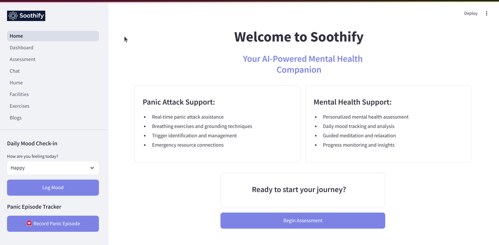
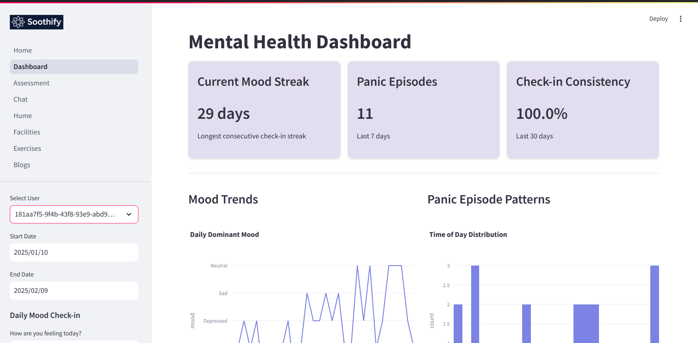
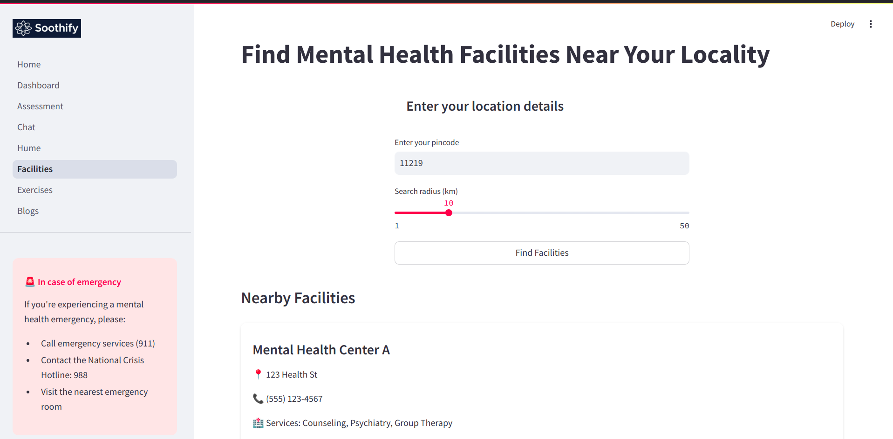
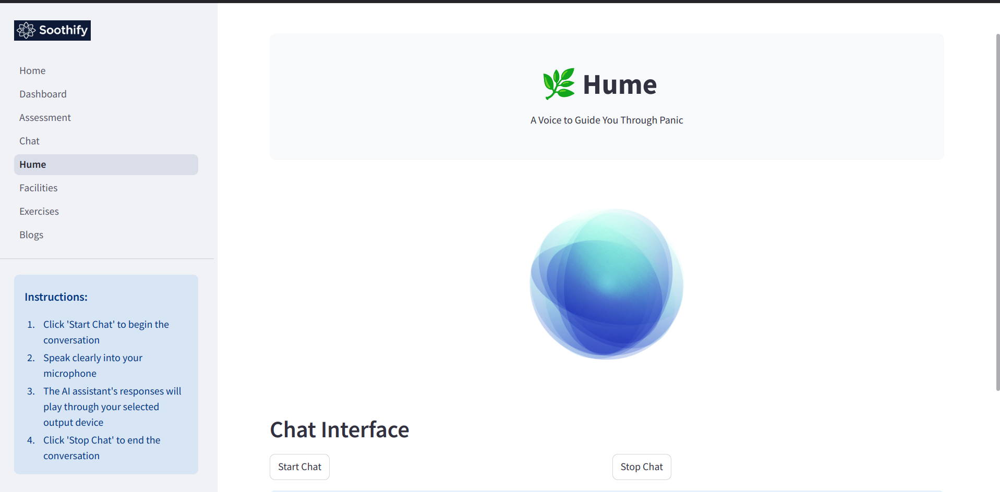

# hacknyu-project

**Built with:**     

**Team Name:** Team ORS - We are going to rehydrate your dehydrated emotional health.

**Contributors:** Om Thakur, Rigved Shirvalkar, Sohith Bandari (ORS)

# Introduction


Find compassionate support through natural voice chats. No more silent battles or appointment waits.

**What it does:**

A voice-based companion that listens and supports you through daily emotional challenges.

**Features:**
- Voice chat for natural conversations
- Responds with empathy to your feelings
- Available anytime you need support

**Backstory:**
The idea sparked when I found my roommate having a severe panic attack one night, unable to reach his therapist, which revealed the critical need for 24/7 emotional support. His months of silent struggles and midnight battles with anxiety in our shared apartment drove me to envision a solution that would always be there. Watching how simply talking aloud helped him calm down during recovery periods led to our voice-first approach, moving beyond traditional text-based support. Each of his episodes taught us that people need a compassionate voice to guide them through their darkest moments, especially when their hands shake too much to type. What began as a solution for one person's struggle evolved into a mission to ensure no one faces their emotional battles alone, creating a voice companion that listens and supports whenever needed.

# Screenshots

<table>
  <tr>
    <td></td>
    <td></td>
  </tr>
  <tr>
    <td></td>
    <td></td>
  </tr>
</table>

# Project Setup Guide
This guide will help you set up and run the project locally.

**Prerequisites:**

- Python 3.12
- Git
- An OpenAI API key

## Installation Steps
First, clone the repository
```
https://github.com/Billa-Man/hacknyu-project.git
cd <project-directory>
```

### 1. Virtual Environment Setup
Create and activate a Python virtual environment:
```
# Create virtual environment
python3 -m venv hacknyu

# Activate virtual environment
# For Unix/macOS
source hacknyu/bin/activate

# For Windows
# hacknyu\Scripts\activate
```

### 2. Environment Configuration
Create a `.env` file in the project root:
```
# Create .env file
touch .env
```
Open and add the following configuration to your .env file:
```
# OpenAI API Configuration
OPENAI_API_KEY=YOUR_OPENAI_API_KEY

# GitHub API Configuration
DATABASE_HOST=YOUR_MONGODB_DATABASE_HOST

# Database Configuration
DATABASE_NAME=YOUR_MONGODB_DATABASE_NAME

# Hume API Configuration
HUME_API_KEY=YOUR_HUME_API_KEY
HUME_SECRET_KEY=YOUR_HUME_SECRET_KEY
```
**Important:** Replace the placeholder values:

- YOUR_OPENAI_API_KEY: Your OpenAI API key from https://platform.openai.com
- YOUR_MONGODB_DATABASE_HOST: The hostname/address where your MongoDB database is hosted (e.g., localhost, mongodb://host:port, or a connection string)
- YOUR_MONGODB_DATABASE_NAME: The name of your MongoDB database that you want to connect to
- YOUR_HUME_API_KEY && YOUR_HUME_SECRET_KEY: Your Hume API keys from https://platform.hume.ai

**For security reasons:**
- Never commit the .env file to version control
- Keep your API keys and passwords secure
- Make sure .env is included in your .gitignore file

### 3. Dependencies Installation
Install all required packages:
```
pip install -r requirements.txt
```

# Usage
Simply run the following code in your project directory after activating the environment:
```
streamlit run Home.py
```
